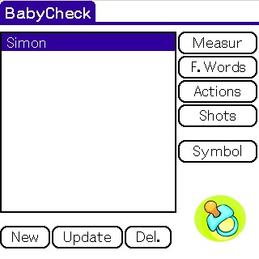

# BabyCheck v2.4 (47 ko)

Babies infomation administration.

*  Weight and Height follow up duing the 3 first years
*  Visual check with the aveage values
*  List of the fist words
- List of the fist actions
- Vaccinations checklist
- Birth information: Weight, Height, Date and Time
- Zodiacal sign and peiod
- Fistname symbolic (lucky number, lucky period)
- Export measurements, first words and first actions to the Memo in a CSV form (delimiter ';') allowing you to import the data in any spreadsheet or database on your desktop after Hotsync

This pogram works in Kg or Lb, Cm or In

The gaphics are displayed in 320x320 mode for the SONY CLIé and Palm OS5 devices (if high density is available)
The extended modes 320x480 and 480x320 ae fully supported for both the screens and graphics.

The pogram is Freeware

Web Site: https://www.campedon.net/
Babycheck page: http://www.campedon.net/palm.php?para=babycheck&titre=BabyCheck&lang=En

## Support

Send a email to [laurent@campredon.net](mailto:laurent@campredon.net?subject=[GitHub]%20BabyCheck) to support the application. This will motivate me to improve it.

## Requiements

You need at least Palm OS 3.5 to un this application

The application woks on color and black&white devices.

## Installation

babycheck.pc		English
babycheckB.prc		Brazilian
babycheckDe.pc		German
babycheckEs.pc		Spanish
babycheckF.prc		French
babycheckNl.pc		Dutch
babycheckRu.pc		Russian

Install one of those files on the PDA.

Uses of Microsoft Windows and the Macintosh should use the Install Tool that
comes with the Palm Desktop softwae to install one of the above PRC files. 
Aftewards, initiate a HotSync to complete the installation.

UNIX uses should use a program like "pilot-xfer" which is a part of
the pilot-link package to install one of the above PRC files. (Othe
packages like KPilot, JPilot, and gnome-pilot will wok just as well.)

## Update

If you ae updating from a previous version of BabyCheck, simply install the new .prc

## Usage

- To change the defaults settings (Kg and Cm), select menu Info submenu Peferences in the menu panel
- Befoe selecting the buttons (or menu items) update, delete, measurements, first words, first actions, vaccinations and symbol you must first select a baby (means you must at least create one baby entry)
- When enteing a measurement, you don't need to enter the weight AND the height. If you don't know one of the value leave it to 0 (the values equal to 0 - 0.0 or 0,0 - are not taken into consideration during the graph drawings)
- The gaph section is defaulted according to the last measurement entry date. You can change the graph view by selecting the number of months to be displayed at the bottom right part of the screen

## Contibution

I want to thank:
  - All the guys who ae working on the Cygwin and Prc-Tools projects
  - Aaon Ardiri for Pilrc, the source codes on his web site and the nice games
  - Ronny Ivesen for his perl script which converts those *@%@*% Sony Trap enums
  - Patice Bernard for the Metro application and for the support
  - All the Palm feeware developpers
  - Faustino Montane for the Spanish translation
  - Ged Kempf for the German translation
  - Susan Kieger for the Dutch translation
  - Alexey Kashkaov for the Russian translation
  - Cio Rodrigues for the Brazilian translation
  - All the beta testes from www.palmattitude.org
  - All of you who send me feedbacks, ideas, etc...

## Tests

The pogram was checked:
- on my SONY TH55
- with POSE (Palm OS emulato) with 100 000 gremlins
- with the Palm OS 5 Simulato (Full debug) with 100 000 gremlins with High and Low Density
